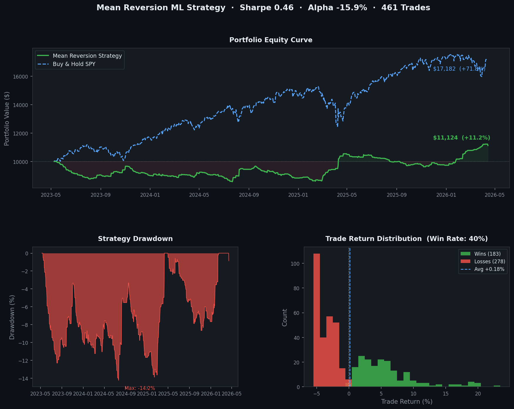

**Live API:** https://mean-reversion-ml.onrender.com/docs

# Mean Reversion ML Pipeline

An end-to-end ML pipeline for detecting mean reversion opportunities in large-cap equities. Pulls real price data, engineers technical indicators, trains a classifier, backtests the strategy against the S&P 500, and serves predictions via a REST API.

---

## How it works

Mean reversion is the tendency for assets that move far from their historical average to snap back. The model learns which combinations of Bollinger Band position, Z-score, RSI, and volatility are predictive of that snap-back happening within 5 trading days.

```
yfinance → ingest → feature engineering → train → backtest → FastAPI
```

**Model performance:** 93% accuracy, 0.97 ROC-AUC on held-out test data

**Backtest (3 years, 461 trades):** 0.46 Sharpe ratio, -14.2% max drawdown vs S&P 500's -18.8%



---

## Quickstart

```bash
git clone https://github.com/YOUR_USERNAME/mean-reversion-ml.git
cd mean-reversion-ml
pip install -r requirements.txt

# Download data, engineer features, train model
python run_pipeline.py

# Backtest against S&P 500
python backtest.py

# Start the API
python -m uvicorn src.api.main:app --reload
```

Then go to `http://localhost:8000/docs` for the interactive UI.

---

## API

```bash
curl -X POST http://localhost:8000/predict \
  -H "Content-Type: application/json" \
  -d '{"ticker": "AAPL"}'
```

```json
{
  "ticker": "AAPL",
  "signal": "REVERSION_LIKELY",
  "confidence": 0.66,
  "last_close": 260.48,
  "interpretation": "AAPL is 1.76 std devs above its 20-day average with neutral RSI (67.5). Bollinger %B = 0.94. Model assigns 66% probability of reversion within 5 days.",
  "features": {
    "zscore": 1.7559,
    "rsi": 67.47,
    "bb_pct_b": 0.939,
    "dist_from_sma": 0.0284,
    "volatility": 0.2469,
    "volume_ratio": 0.7657
  }
}
```

---

## Features

| Feature | Description |
|---|---|
| `bb_pct_b` | Bollinger %B — where price sits within the bands |
| `bb_width` | Band width, proxy for volatility regime |
| `zscore` | Rolling z-score vs 20-day mean |
| `rsi` | 14-day RSI |
| `volatility` | Annualised rolling volatility |
| `dist_from_sma` | % deviation from 20-day SMA |
| `volume_ratio` | Volume vs its 20-day average |

Top features by importance: `bb_pct_b` (0.36), `zscore` (0.28), `bb_position` (0.13)

---

## Project structure

```
├── config.yaml           # all parameters in one place
├── run_pipeline.py       # runs ingest → features → train
├── backtest.py           # walk-forward backtest vs S&P 500
├── src/
│   ├── pipeline/
│   │   ├── ingest.py     # downloads OHLCV data via yfinance
│   │   ├── features.py   # computes technical indicators
│   │   └── train.py      # labels data, trains Random Forest
│   ├── api/
│   │   ├── main.py       # FastAPI app
│   │   └── schemas.py    # Pydantic request/response models
│   └── utils/
│       └── logger.py
└── tests/
    └── test_features.py
```

---

## Stack

Python · scikit-learn · FastAPI · pandas · yfinance · matplotlib

---

*For educational purposes only. Not financial advice.*
